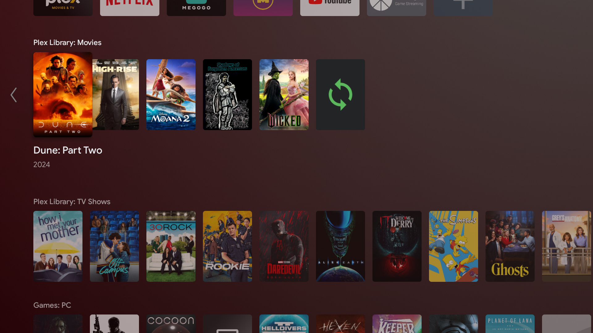
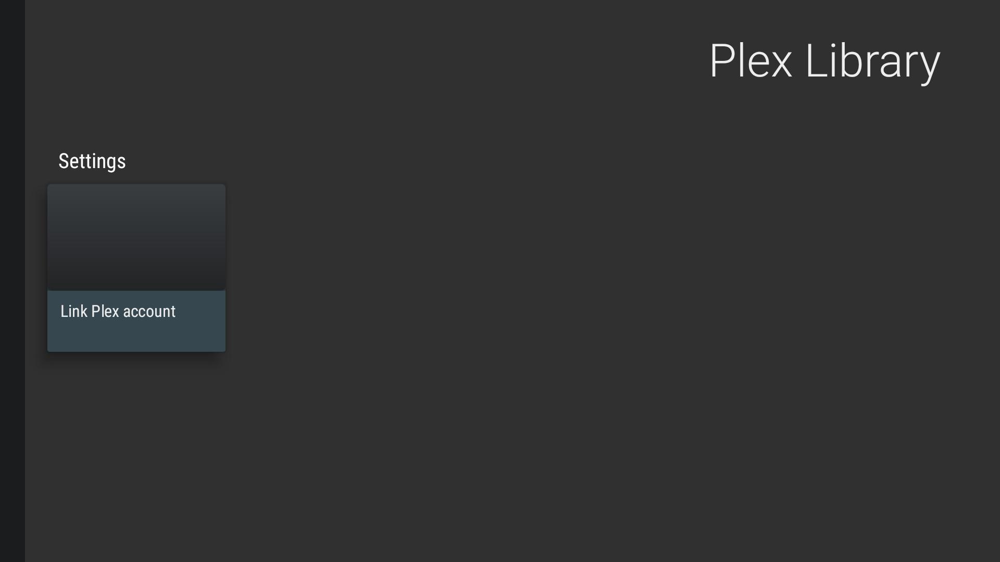
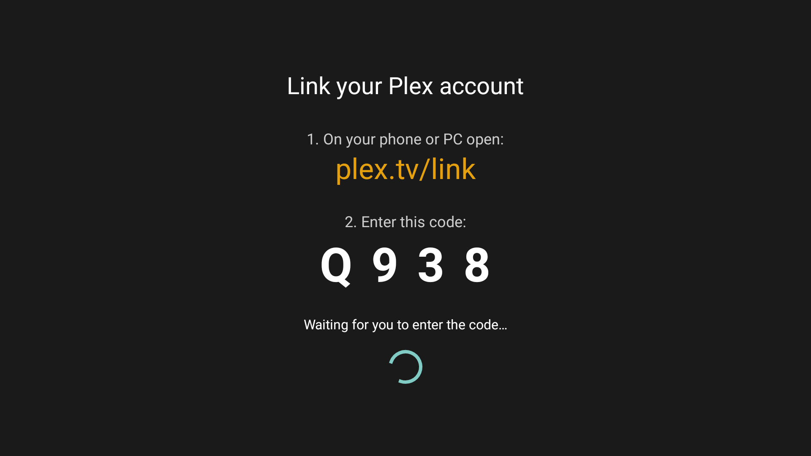
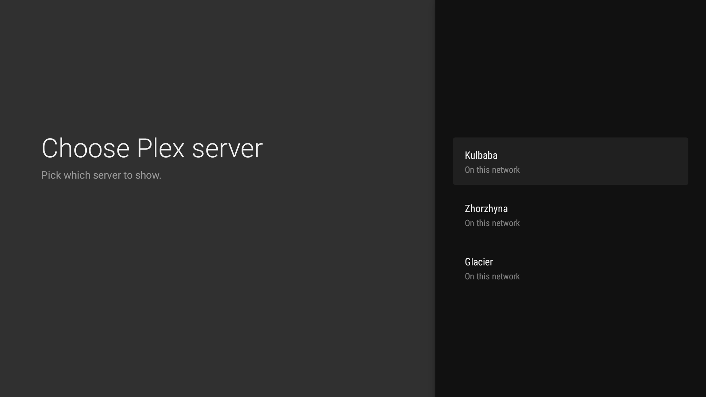
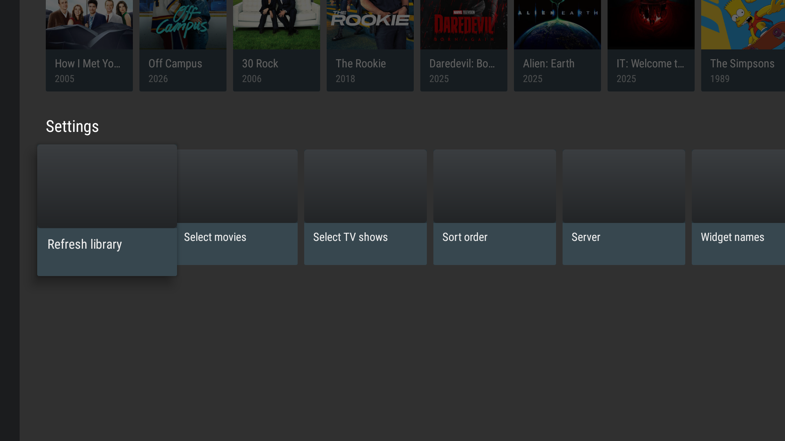

# Plex Android TV Widget

A lightweight **Android TV** app that puts your **[Plex](https://www.plex.tv/)** library on the home
screen as **two channels** — one for **Movies**, one for **TV Shows**. Selecting a movie **plays it
instantly** in the Plex app; selecting a show opens its **next unwatched episode**.

> 🇺🇦 Українською: [README.uk.md](README.uk.md)



## About this project

I'm **not a programmer** — I built this entirely with **Claude Code**, originally just for myself.
I'm sharing it in case it's useful to someone else.

**Pray for Ukraine!** 💙💛 🇺🇦

## Features

- 🎬 Two separate **home-screen channels**: **Movies** and **TV Shows**.
- ▶️ Click a **movie** → it **starts playing** in Plex. Click a **show** → its **first unwatched
  episode** starts (watched episodes are skipped).
- 🖼️ **Poster art** for every title.
- 🔗 **Keyboard-free sign-in** via the official **plex.tv/link** PIN flow.
- 🖥️ **Server picker** — choose which Plex Media Server to show if your account has several.
- 🔀 **Sort order**: *recently watched* or *alphabetical*.
- ✅ **Per-title checkboxes** — pick which titles appear in each channel (all shown by default).
- ↻ A **refresh tile** at the end of each channel, plus auto-refresh on app open and in the background.
- ✏️ Customizable **channel names**.
- 🇬🇧🇺🇦 **English** and **Ukrainian** localizations.

## Screenshots

| Link account | plex.tv/link code | Choose server |
|---|---|---|
|  |  |  |

| Settings | Home-screen channels |
|---|---|
|  |  |

## How it works

```
This app ──(plex.tv/link PIN)──► your Plex account token
   │  /api/v2/resources → discover your Plex Media Server(s) (+ per-server token)
   │  /library/sections + /library/sections/{id}/all → movies & shows
   │  /photo/:/transcode → poster art
   ▼
Two channels (Movies + TV Shows) on the Android TV home screen
   │
   ▼ (you click a card)
Movie → plays in Plex's player; Show → plays its first unwatched episode
```

### How clicking a card opens content (verified on a real Android TV)

[`PlexLauncher`](app/src/main/java/com/androidtv/plexwidget/launch/PlexLauncher.kt) uses the exact
intents Plex itself uses:

- **Movie** → `plex://server://{machineId}/com.plexapp.plugins.library/library/metadata/{ratingKey}`
  (the same intent Plex's own home-screen channel cards carry) → **starts playback immediately**.
- **Show** → its first **unwatched** episode is found via `/library/metadata/{id}/allLeaves`
  (`viewCount == 0`) and played the same way. If everything is watched, the show's
  `watch.plex.tv` page opens instead.

Home-screen cards point at our invisible [`OpenItemActivity`](app/src/main/java/com/androidtv/plexwidget/ui/OpenItemActivity.kt)
trampoline rather than carrying these cross-package intents directly — the Google TV launcher
rewrites the package on intents it fires itself, so the trampoline re-issues them from our process.

> ⚠️ These deep links use Plex app internals (not an official public API). They work today
> (tested on Android TV), but a future Plex update could change them.

## Requirements

- Android TV **API 21+** (the home-screen channels require **API 26+ / Android 8**).
- The **[Plex](https://play.google.com/store/apps/details?id=com.plexapp.android)** app installed on the TV.
- A **Plex account** with at least one Plex Media Server (Movies and/or TV Shows libraries).

## Install

1. Download the latest **`PlexAndroidTVWidget-x.y.apk`** from the [Releases](../../releases) page.
2. Sideload it onto your Android TV, either:
   - **ADB:** `adb connect <TV-IP>:5555` then `adb install PlexAndroidTVWidget-x.y.apk`, or
   - **USB / file manager:** copy the APK to the TV and open it (enable "install from unknown sources").

## Setup

1. On the TV, open **Plex Library** → **Settings** row → **Link Plex account**.
2. A code appears. On your phone or PC go to **`plex.tv/link`**, sign in, and enter the code.
3. If your account has more than one server, **pick which one** to show.
4. The app syncs your Movies and TV Shows automatically.
5. Add the **Movies** and **TV Shows** channels to the home screen via the launcher's
   "Customize channels".
6. Optional, under **Settings**: **Select movies / TV shows** (choose what appears), **Sort order**,
   **Server** (switch servers), **Widget names**.

## Build from source

Requirements: **JDK 17**, **Android SDK** (compile SDK 34). The Gradle wrapper is included.

```bash
# Windows
gradlew.bat assembleDebug
# macOS / Linux
./gradlew assembleDebug
```

The APK is produced at `app/build/outputs/apk/debug/PlexAndroidTVWidget-debug.apk`.
Open the project in **Android Studio** for the easiest setup (it bundles a JDK).

To build a **signed release**, create a `keystore.properties` at the repo root (it's gitignored):

```properties
storeFile=release.keystore
storePassword=your-password
keyAlias=your-alias
keyPassword=your-password
```

…then run `gradlew.bat assembleRelease`. Without it, the project still builds (release comes out unsigned).

## Known limitations

- These deep links rely on **Plex app internals** — they work now but aren't a guaranteed public API.
- Titles with no server id / catalog slug (e.g. unmatched "Other Videos") fall back to opening the Plex app.
- Some launchers prefix the channel with the app label and a colon (e.g. `Plex Library:`); this is
  launcher-controlled and can't be removed via the channel API.

## License

Licensed under the **GNU General Public License v3.0** — see [LICENSE](LICENSE).
